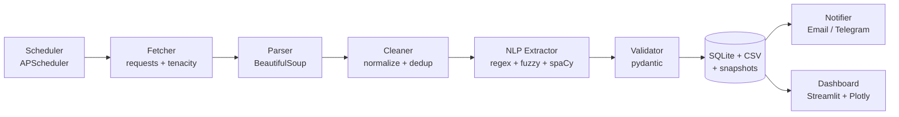

<div align="center">


# 📡 SkillPulse
### Automated Tech-Job Market Scraper · NLP Skill Extractor · Live Dashboard


*Built for the Progree Data Science Internship, Task 2: Automated Unstructured Web Scraping & Data Extraction Pipeline*

</div>

---

## 📖 Overview

**SkillPulse** is an end-to-end, scheduled data pipeline. It harvests job listings from public web sources, pulls structured fields (title, company, location, salary, remote flag, seniority, **skills**) out of unstructured text with regex + fuzzy matching + spaCy NER, cleans and de-duplicates them, stores them in **CSV + SQLite**, and shows the results in an interactive **Streamlit** dashboard. Email or Telegram alerts fire when new jobs match your keywords.

> **Try it in 60 seconds, no internet needed:** `python main.py --demo` then `streamlit run dashboard/app.py`

---

## ✨ Features

- 🌐 **Resilient fetching**: rotating User-Agents and headers, timeouts, exponential-backoff retries (`tenacity`), polite delays with jitter, pagination, `Retry-After` support
- 🤖 **Responsible scraping**: checks `robots.txt` for HTML sources, rate limiting, clear logging
- 🧩 **Robust parsing**: configurable CSS selector *fallback chains*; a missing field becomes `None`, never a crash
- 🧹 **Thorough cleaning**: whitespace / tab / newline / zero-width removal, Unicode NFKC normalisation, standardised dates, locations and URLs, hash-based de-duplication
- ✅ **Schema validation** of every record with `pydantic`
- 🧠 **NLP extraction**: 85+ skills taxonomy with boundary-aware matching (`Java` ≠ `JavaScript`), fuzzy typo matching, salary ranges (`$140k-$170k`, `€60k–80k`, `120-150k USD`), remote detection (understands "no remote"), seniority, spaCy NER (optional)
- 💾 **Dual storage**: append-only CSV + SQLite with a run log and **historical snapshots** for trend analysis
- ⏰ **Automation**: APScheduler; every run logs start, end, counts and errors
- 🔔 **Alerts**: HTML email digest (`smtplib`) and Telegram messages on keyword matches
- 📊 **Dashboard**: KPIs, filters, top skills, skill-trend lines, co-occurrence heatmap, salary analysis, searchable table, CSV download, pipeline history
- 🪵 `loguru` logging · `config.yaml` for settings · `.env` for secrets · `pytest` test-suite

---

## 🏗️ Architecture



### Data sources

| Source | Type | Notes |
|---|---|---|
| `fake_jobs` | HTML (BeautifulSoup) | A practice site built for scraping. Great for learning and safe to hit. |
| `hn_hiring` | Public JSON API | Latest Hacker News "Ask HN: Who is hiring?" thread via the Algolia API. Rich text with skills and salaries. |
| `demo` | Synthetic | Generated offline by `python main.py --demo` (clearly labelled `source = demo`). |

Add your own source by writing a `collect_<name>()` function in `main.py` and registering it in `COLLECTORS`.

---

## 📁 Folder Structure

```
skillpulse/
├── config/config.yaml          # all settings, selectors, skills taxonomy
├── data/
│   ├── output.csv              # cleaned records (append-only)
│   └── database.db             # SQLite database (ships with demo data)
├── logs/scraper.log
├── src/
│   ├── config_loader.py        # YAML + .env loading, pydantic-validated config
│   ├── fetcher.py              # HTTP, retries, user-agents, robots.txt, pagination
│   ├── parser.py               # HTML / JSON parsing
│   ├── cleaner.py              # normalise, dedup, pydantic schema
│   ├── nlp_extractor.py        # skills, salary, remote, seniority, entities
│   ├── storage.py              # CSV + SQLite + snapshots
│   ├── notifier.py             # email / Telegram
│   ├── scheduler.py            # APScheduler jobs
│   ├── demo_data.py            # synthetic data for --demo
│   └── utils.py                # logging setup, hashing, helpers
├── dashboard/app.py            # Streamlit dashboard
├── tests/                      # parser, cleaner, nlp, storage, fetcher, pipeline
├── docs/                       # banner, screenshots, resume/LinkedIn text
├── .streamlit/config.toml      # dark theme
├── main.py                     # runs one full pipeline cycle
├── requirements.txt · .env.example · .gitignore · LICENSE · README.md
```

---

## 🚀 Installation

**Prerequisites:** Python 3.10, 3.11 or 3.12, and Git.

```bash
git clone https://github.com/<your-username>/skillpulse.git
cd skillpulse

python -m venv venv
source venv/bin/activate            # Windows: venv\Scripts\activate

pip install -r requirements.txt
python -m spacy download en_core_web_sm   # optional: enables NER (pipeline works without it)

cp .env.example .env                # optional: only needed for alerts
```

### Environment variables (`.env`)

| Variable | Purpose |
|---|---|
| `SMTP_HOST`, `SMTP_PORT` | Mail server (e.g. `smtp.gmail.com`, `587`) |
| `SMTP_USER`, `SMTP_PASSWORD` | Login. Use an **app password**, never your real password |
| `ALERT_EMAIL_TO` | Where the digest is sent |
| `TELEGRAM_BOT_TOKEN`, `TELEGRAM_CHAT_ID` | Optional Telegram alerts |

Leave them blank to skip alerts.

### Configuration (`config/config.yaml`)

Active sources, selectors (with fallbacks), request delays and retries, schedule interval, NLP options, alert keywords and the skills taxonomy all live here. Nothing is hard-coded in the source.

---

## ▶️ Usage

```bash
python main.py --demo                  # instant synthetic data (8 weekly snapshots)
python main.py                         # one real scrape of every active source
python main.py --sources fake_jobs     # only one source
python main.py --no-alerts             # scrape without sending alerts

python -m src.scheduler                # run automatically every N hours (config.yaml)
streamlit run dashboard/app.py         # open the dashboard
pytest                                 # run the tests
```

Outputs: `data/output.csv`, `data/database.db`, `logs/scraper.log`.

---

## 🖼️ Screenshots

Run the dashboard, take screenshots and save them in `docs/screenshots/`.

| Overview | Skill trends | Salaries |
|---|---|---|
| `docs/screenshots/overview.png` | `docs/screenshots/skills.png` | `docs/screenshots/salaries.png` |

---

## 🧰 Tech Stack

| Layer | Tools |
|---|---|
| Language | Python 3.10+ |
| Scraping | `requests`, `BeautifulSoup4` |
| Resilience / anti-bot | `fake-useragent`, `tenacity`, delays + jitter, `robots.txt` |
| NLP | `spaCy`, `rapidfuzz`, regex |
| Validation | `pydantic` |
| Storage | SQLite (`sqlite3`), CSV |
| Scheduling | `APScheduler` |
| Dashboard | `Streamlit`, `Plotly`, `pandas` |
| Alerts | `smtplib`, Telegram Bot API |
| Config & logging | `PyYAML`, `python-dotenv`, `loguru` |
| Testing | `pytest` |

---

## ⚖️ Responsible Scraping

- Only scrape sources that allow it. Check each site's `robots.txt` and Terms of Service.
- `fake_jobs` is a practice site built for scraping. `hn_hiring` uses a documented public API.
- Keep the delays on and never overload a server.
- Only public listing data is collected, no personal data.

---

## 🔮 Future Improvements

- Sentence-transformer embeddings to cluster similar jobs
- Salary prediction from extracted skills
- More source adapters (RSS feeds, public APIs)
- Docker image and `docker-compose`
- PostgreSQL support
- Skill-demand forecasting

---

## 📄 License

MIT. See [LICENSE](LICENSE).

## 👤 Author

**Your Name** · Data Science Intern, Progree
[LinkedIn](https://linkedin.com/in/<your-handle>) · [GitHub](https://github.com/<your-username>)

<div align="center">⭐ If you like this project, give it a star!</div>
